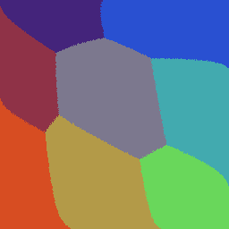
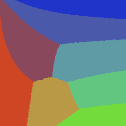
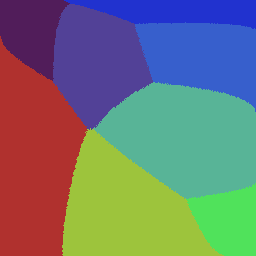
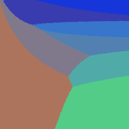
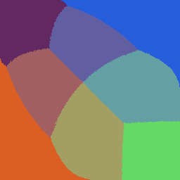
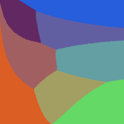

# spotpix
An image quantization application written in plain Java.

## Downloads
- TODO

## Features
### Quantization
- Quantize using K-Means algorithm.
- Quantize using Median-Cut algoritm.
- Quantize using Octree algorithm.
- Quantize using RGB collapse algorithm.
### Misc.
- Search using a set of colors (from an open image) and a target images count.
- Crop.
- Upscale and downscale using linear and nearest filters
- Display colors' amounts per image
- Display RGB color graphs.

## FLT format
An indexed images format that saves each color in the colormap's repeatition, the format's standard is provided in [Encoder's code](./src/main/java/io/codeberg/spotpix/model/encoders/FLTEncoder.java).

# Snapshots
### Original Image

### 8-Colors K-Means
#### RGB

#### LAB

### 8-Colors Median Cut
#### RGB

#### LAB

### 8-Colors Octree
#### RGB

#### LAB

## Development Requirements
- Anything that understands POM files.

## Contributions
We are open to adding more features (especially quantization algorithms !) to our project, gui improvements are also encouraged.

## License
Under [GPL 3.0](./LICENSE)
